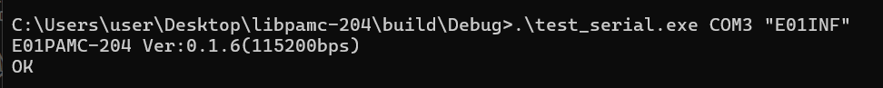

# libpamc-204

クロスプラットフォーム対応のPAMC204制御用ライブラリです。  
Windows では DLL、Linux/WSL2 では SO としてビルドできます。

## 📦 必要環境

- **Linux / WSL2**
  - g++ (C++17以上)
  - cmake (3.10以上推奨)
- **Windows**
  - Visual Studio 2022 または VSCode + CMake Tools
  - CMake (3.10以上)

## 📂 プロジェクト構成

```text
libpamc-204/
├── CMakeLists.txt              # ビルド設定（Windows/Linux両対応）
├── README.md
├── include/                    # 公開ヘッダ
│   └── pamc204.h               # メインAPI
├── src/
│   ├── core/                   # プラットフォーム非依存コード
│   │   ├── api.cpp             # 高レベルAPI実装
│   │   ├── utils.cpp           # 共通ユーティリティ
│   │   └── utils.h             # 内部ヘッダー
│   └── platform/               # プラットフォーム固有実装
│       ├── windows/
│       │   └── serial.cpp      # Windows実装（Win32 API）
│       └── linux/
│           └── serial.cpp      # Linux実装（termios）
└── demo/                       # サンプルコード
    └── main.cpp
```

## 🔧 ビルド方法

### Linux / WSL2

```bash
cd libpamc-204
mkdir -p build && cd build
cmake ..
cmake --build .
```

生成物:

- `./build/libpamc204.so` (共有ライブラリ)
- `./build/test_serial` (テスト用実行ファイル)

### Windows

```powershell
cd libpamc-204
mkdir build
cd build
cmake ..
cmake --build .
```

生成物:

- `build\Debug\pamc204.dll` (DLL本体)
- `build\Debug\pamc204.lib` (インポートライブラリ)
- `build\Debug\test_serial.exe` (動作確認用実行ファイル)

## ▶️ 使い方

### 🎯 高レベルAPI（推奨）

個別コマンド専用関数を使用する方法：

```cpp
#include "pamc204.h"

// C++ API（名前空間で保護）
pamc204::get_firmware_version(1);           // E01INF
pamc204::check_device(1);                   // E01
pamc204::set_voltage(1, 4095);              // E01DAC4095 (150V)
pamc204::rotate_positive(1, 1500, 1000, 'A'); // E01NR15001000A
pamc204::stop(1);                           // E01S
pamc204::set_acceleration(1, 1, 10000);     // E011AC10000
pamc204::query_acceleration(1, 1);          // E011AC?
pamc204::set_velocity(1, 1, 1500);          // E011VA1500
pamc204::move_absolute(1, 1, 10000);        // E011PA10000
pamc204::move_relative(1, 1, 5000);         // E011PR5000
pamc204::query_actual_position(1, 1);       // E011TP?
pamc204::move_infinite(1, 1, '+');          // E011MV+
pamc204::stop_motion(1, 1);                 // E011ST
pamc204::abort_motion(1);                   // E01AB

// 4軸同時操作（DLLレベル拡張）
pamc204::move_relative_all_channels(1, 500);  // 全軸を+500移動
pamc204::move_infinite_all_channels(1, '+');  // 全軸を+方向に無限移動
pamc204::stop_motion_all_channels(1);         // 全軸の動作を停止
int actual_positions[4];
pamc204::query_actual_position_all_channels(1, actual_positions);
int statuses[4];
pamc204::query_motion_status_all_channels(1, statuses);

// C API（pamc204_プレフィックスで保護）
pamc204_get_firmware_version(1);
pamc204_check_device(1);
pamc204_set_voltage(1, 4095);
pamc204_rotate_positive(1, 1500, 1000, 'A');
pamc204_stop(1);
pamc204_set_acceleration(1, 1, 10000);
pamc204_query_acceleration(1, 1);
pamc204_set_velocity(1, 1, 1500);
pamc204_move_absolute(1, 1, 10000);
pamc204_move_relative(1, 1, 5000);
pamc204_query_actual_position(1, 1);
pamc204_move_infinite(1, 1, '+');
pamc204_stop_motion(1, 1);
pamc204_abort_motion(1);

// 4軸同時操作（DLLレベル拡張）
pamc204_move_relative_all_channels(1, 500);
pamc204_move_infinite_all_channels(1, '+');
pamc204_stop_motion_all_channels(1);
int actual_positions[4];
pamc204_query_actual_position_all_channels(1, actual_positions);
int statuses[4];
pamc204_query_motion_status_all_channels(1, statuses);
```

### � 低レベルAPI

汎用コマンド送信（柔軟性が高い）：

```cpp
#include "pamc204.h"

// C++ API
pamc204::send_command("E01INF");
pamc204::send_command("E01NR15001000A");

// C API
pamc204_send_command("E01INF");
```

戻り値:

- `true`: 成功
- `false`: エラー

### 📋 コマンドリファレンス

| No | コマンドフォーマット | 使用例 | 説明 |
|----|------------------|--------|------|
| 1 | `ExxINF` | `send_command("E01INF")` | ファームウェアバージョン確認 |
| 2 | `Exx` | `send_command("E01")` | デバイス存在確認 |
| 3 | `SETADDRxx` | `send_command("SETADDR02")` | アドレス変更（E02に変更） |
| 4 | `ExxDACnnnn` | `send_command("E01DAC4095")`<br>`send_command("E01DAC1900")` | 駆動電圧調整（150V / 70V）<br>範囲: 70V～150V |
| 5 | `ExxNRnnnnyyyyz`<br>`ExxNRnnnnXyyyyyyz` | `send_command("E01NR15001500A")`<br>`send_command("E01NR1500X100000A")`<br>`send_command("E01NR15000000A")` | 正回転駆動<br>1500Hz/1500パルス<br>1500Hz/100000パルス<br>1500Hz/連続 |
| 6 | `ExxRRnnnnyyyyz`<br>`ExxRRnnnnXyyyyyyz` | `send_command("E01RR15001500B")`<br>`send_command("E01RR1500X100000B")` | 逆回転駆動<br>1500Hz/1500パルス<br>1500Hz/100000パルス |
| 7 | `ExxS` | `send_command("E01S")` | パルス駆動停止 |
| 8 | `ExxAB` | `send_command("E01AB")` | モーション停止（全CH即停止） |
| 9 | `ExxmACnnnn` | `send_command("E011AC10000")` | 加速度設定（10000 steps/sec²）<br>範囲: 1～150000 |
| 10 | `ExxmAC?` | `send_command("E011AC?")` | 加速度問い合わせ |
| 11 | `ExxmVAnnnn` | `send_command("E011VA1500")` | 速度設定（1500 steps/sec）<br>範囲: 1～1500 |
| 12 | `ExxmVA?` | `send_command("E011VA?")` | 速度問い合わせ |
| 13 | `ExxmDHnnnn` | `send_command("E011DH0")` | ホームポジション設定 |
| 14 | `ExxmDH?` | `send_command("E011DH?")` | ホームポジション問い合わせ |
| 15 | `ExxmPAnnnn` | `send_command("E011PA10000")` | 絶対位置移動（位置10000）<br>範囲: -2147483648～+2147483647 |
| 16 | `ExxmPA?` | `send_command("E011PA?")` | 絶対位置問い合わせ |
| 17 | `ExxmPRnnnn` | `send_command("E011PR5000")` | 相対位置移動（+5000） |
| 18 | `ExxmPR?` | `send_command("E011PR?")` | 相対位置問い合わせ |
| 19 | `ExxmTP?` | `send_command("E011TP?")` | 実位置問い合わせ |
| 20 | `ExxmMD?` | `send_command("E011MD?")` | 動作状態確認 |
| 21 | `ExxmMVn` | `send_command("E011MV+")` | 無限移動（+方向）<br>方向: + または - |
| 22 | `ExxmMV?` | `send_command("E011MV?")` | 移動方向問い合わせ |
| 23 | `ExxmST` | `send_command("E011ST")` | 動作停止 |

**パラメータ説明:**

- `xx`: アドレス（01～32）
- `nnnn`: 周波数（1～1500 Hz）、加速度、速度、位置など
- `yyyy`: パルス数（0000～9999、0000=連続）
- `Xyyyyyy`: 拡張パルス数（X000001～X999999）
- `z`: チャンネル（A=CH1, B=CH2, C=CH3, D=CH4）
- `m`: チャンネル番号（1～4）
- `n`: 方向（+ または -）

### エラーメッセージ

| エラー | 説明 |
|--------|------|
| `Error Value Range` | 出力電圧の値が範囲外（70V～150V） |
| `ERROR` | 回転方向、周波数、チャンネル指定が不正 |
| `ERROR1` | コマンド認識不可 |
| `ERROR4` | 6桁パルス数が範囲外（X000001～X999999） |
| `ERROR5` | 4桁パルス数が範囲外（0001～9999） |
| `BUSY` | ドライバ駆動中（停止後に再送信） |

## 🧪 テスト実行方法

### Linux / WSL2

```bash
sudo ./test_serial "E01INF"
```

### Windows

```powershell
.\Debug\test_serial.exe "E01INF"
```

※ `usbipd`でWSLにattachしてるときはdetatchすること

```powershell
usbipd detach --busid 1-1
```

### 動的ライブラリの動作確認

```bash
# Linux/WSL2
sudo python3 test_linux_all_apis.py 
```

```powershell
# Windows
python3 test_windows_all_apis.py 
```

## 🧪 テスト記録

- Windows


## memo

### WSL2からホストWindows11のUSB機器を使用する方法

[参考](https://watako-lab.com/2025/05/18/wsl2_usbserial/)

```powershell
# 【usbipdのインストール】
winget install usbipd

#【接続されているUSBデバイスを表示】
usbipd list

#【WSL側で使いたいデバイスをバインド】
usbipd bind --busid 1-1

#【WSL側で使いたいデバイスをアタッチ】
usbipd attach --busid 1-1 --wsl

#【デバイスをデタッチ】
usbipd detach --busid 1-1
```

### Github Actionsによる自動ビルド && リリース

```bash
# タグをつけてpushすればGithub Actionが回る
git tag v1.0.0
git push origin v1.0.0

# tagのpushをやり直したいとき
git push origin :refs/tags/v1.0.0  # リモートのタグを削除
git tag -d v1.0.0                  # ローカルのタグを削除
git tag v1.0.0                     # 再度タグを作成
git push origin v1.0.0             # タグをpush
```
