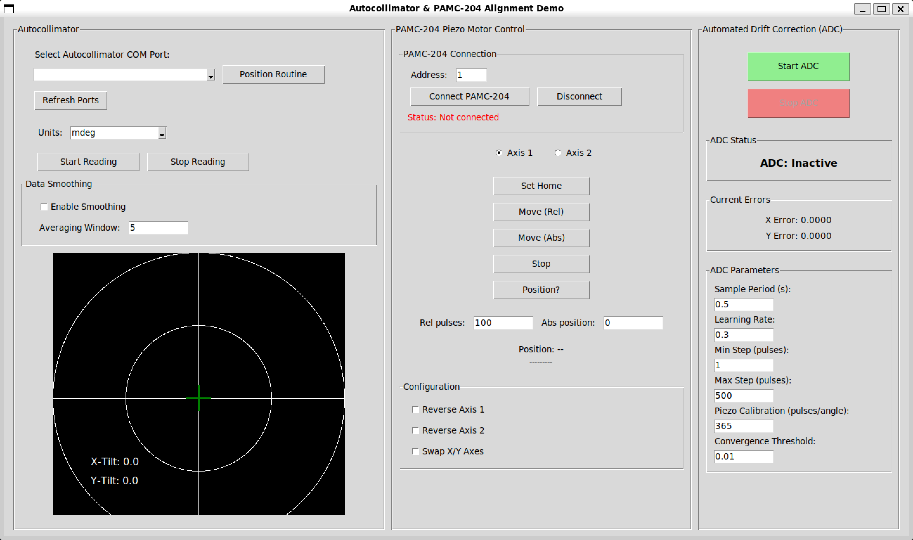

# Autocollimator & Piezo Motor Alignment Demo

オートコリメータ（自動準直器）とピエゾモーターコントローラーを組み合わせた、
**自動ドリフト補正（ADC: Automated Drift Correction）** デモアプリケーションです。

対応コントローラー:

- **PAMC-204**（DLL 経由、デフォルト）
- **PAMC-104 / PAMC-204**（`pamc204_send_command` 経由、`--mode pamc104_204`）

---

## 画面概要



画面は左から **Autocollimator**・**Piezo Motor Control**・**Automated Drift Correction (ADC)** の3パネル構成です。

---

## 何をするプログラムか

| 機能 | 説明 |
| --- | --- |
| **オートコリメータ読み取り** | シリアル通信でオートコリメータから X/Y 傾き角度を連続取得し、リアルタイム表示する |
| **ピエゾモーター手動制御** | DLL または send_command 経由でピエゾモーターを手動で相対移動・停止できる |
| **自動ドリフト補正（ADC）** | オートコリメータの誤差をゼロに近づけるよう、ピエゾモーターを自動制御する（勾配降下法） |
| **ポジションルーティン** | 事前定義された複数の目標位置を順番に移動し、各位置で ADC 収束を待つ自動シーケンス |
| **データロギング** | 測定データ（時刻・X/Y 角度）を CSV 形式でファイル保存する |

### ADC（自動ドリフト補正）の動作原理

```text
オートコリメータ → 角度誤差を計算 → ピエゾモーター ch1/ch2 を順次駆動 → 誤差を縮小
```

- コントローラーは **同時2軸駆動非対応** のため、X軸 → Y軸 の順に **順次駆動**
- キャリブレーション: 1000パルス ≈ 2.74 単位角度（≈ 365 pulses/unit）

---

## ファイル構成

```text
demo/
├── __init__.py              # パッケージ初期化
├── main.py                  # エントリーポイント ← ここから起動
├── gui.py                   # メイン GUI クラス（ADCGUI）・モード定義（PiezoMode）
├── pamc204_wrapper.py       # PAMC-204 DLL ラッパー（PAMC204 クラス）
├── pamc104_204_wrapper.py   # PAMC-104/204 send_command ラッパー（PAMC104_204 クラス）
├── ac_thread.py             # オートコリメータ読み取りスレッド（AcThread）
├── adc_thread.py            # ADC 制御スレッド（ADCControlThread）
└── position_routine.py      # ポジションルーティンスレッド（PositionRoutineThread）
```

---

## 必要環境

- **OS**: Windows（pamc204.dll は Windows 専用）
- **Python**: 3.10 以上
- **依存ライブラリ**:

```bash
pip install pyserial numpy
```

- **pamc204.dll**: 配布済みの `pamc204.dll` を `demo/` フォルダに配置すること

---

## 実行方法

```bash
# 1. pamc204.dll を demo/ フォルダに配置する

# 2. demo/ フォルダに移動
cd demo

# 3. 起動（PAMC-204 DLL モード、デフォルト）
python main.py --dll ./pamc204.dll

# PAMC-104/204両対応モードで起動する場合
python main.py --mode pamc104_204 --dll ./pamc204.dll
```

### モード一覧

| `--mode` | 対応コントローラー | 使用ラッパー | 備考 |
| --- | --- | --- | --- |
| `pamc204`（デフォルト） | PAMC-204 | `pamc204_wrapper.py` | DLL の高レベル API を使用 |
| `pamc104_204` | PAMC-104 / PAMC-204 | `pamc104_204_wrapper.py` | `pamc204_send_command()` で ExxNR/RR コマンドを直接送信 |

---

## 各パネルの説明と操作手順

### 左パネル: Autocollimator

オートコリメータの接続・読み取り・表示を行います。

#### 接続

1. **「Refresh Ports」** をクリックしてシリアルポート一覧を更新
2. ドロップダウンから COM ポートを選択（選択と同時に接続・単位取得）
3. **「Units」** ドロップダウンで角度単位を選択（`min` / `deg` / `mdeg` / `urad`）
4. **「Start Reading」** をクリックして連続読み取り開始
5. 停止するときは **「Stop Reading」** をクリック

#### Position Routine

- **「Position Routine」** ボタンで事前定義された5点を自動巡回（詳細は後述）

#### Data Smoothing（データ平滑化）

| 設定 | 説明 |
| --- | --- |
| Enable Smoothing | チェックで移動平均フィルタを有効化 |
| Averaging Window | 平均化するサンプル数（デフォルト: 5） |

#### 表示キャンバス

- **赤い十字線**: 現在のオートコリメータ測定値（X-Tilt / Y-Tilt）
- **緑の十字線**: ADC の目標位置（ポジションルーティン中に更新）
- 左下に `X-Tilt` / `Y-Tilt` の数値を表示

---

### 中央パネル: Piezo Motor Control

ピエゾモーターコントローラーへの接続と手動操作を行います。

#### 接続

1. **「Address」** にデバイスアドレスを入力（デフォルト: `1`）
2. **「Connect PAMC-204」**（または **「Connect PAMC-104/204」**）をクリック
   - 成功: `Status: Connected (addr=1)` が緑色で表示
   - 失敗: `Status: Connection failed` が赤色で表示
   - **`pamc204` モードでは接続成功時に全チャンネルの速度が 1500 Hz に自動設定される**
3. 切断するときは **「Disconnect」** をクリック

#### 軸選択

- **「Axis 1」** / **「Axis 2」** ラジオボタンで操作対象軸を選択

#### 手動操作ボタン

| ボタン | 動作 |
| --- | --- |
| **Set Home** | 選択軸の現在位置をホームポジション（0）に設定（`pamc204` モードのみ） |
| **Move (Rel)** | 「Rel pulses」欄のパルス数だけ相対移動（正: 正方向、負: 負方向） |
| **Move (Abs)** | 「Abs position」欄の絶対位置へ移動（`pamc204` モードのみ） |
| **Stop** | 動作を停止 |
| **Position?** | 現在位置を問い合わせて表示（`pamc204` モードのみ） |

#### 入力欄

| 欄 | 説明 |
| --- | --- |
| **Rel pulses** | 相対移動のパルス数（デフォルト: 100） |
| **Abs position** | 絶対移動の目標位置（デフォルト: 0、`pamc204` モードのみ） |

#### Configuration（軸設定）

| 設定 | 説明 |
| --- | --- |
| **Reverse Axis 1** | 軸1のパルス方向を反転（物理的な取り付け方向に合わせて調整） |
| **Reverse Axis 2** | 軸2のパルス方向を反転 |
| **Swap X/Y Axes** | X/Y 軸の割り当てを入れ替え（デフォルト: X→ch2, Y→ch1） |

---

### 右パネル: Automated Drift Correction (ADC)

オートコリメータの誤差を自動補正します。

#### 操作

1. オートコリメータ読み取りとコントローラー接続が完了していることを確認
2. **ADC Parameters** を必要に応じて調整
3. **「Start ADC」**（緑ボタン）をクリック → 自動補正開始
   - `ADC Status` が **ADC: Active** に変わる
4. **「Stop ADC」**（赤ボタン）で停止

#### ADC Status

| 表示 | 意味 |
| --- | --- |
| **ADC: Inactive** | 停止中 |
| **ADC: Active** | 補正動作中 |

#### Current Errors

- **X Error**: 現在の X 軸誤差（目標値との差）
- **Y Error**: 現在の Y 軸誤差（目標値との差）

#### ADC Parameters

| パラメータ | デフォルト | 説明 |
| --- | --- | --- |
| **Sample Period (s)** | 0.5 | ADC 制御ループの周期（秒） |
| **Learning Rate** | 0.3 | 補正ステップの大きさ（0〜1、大きいほど積極的に補正） |
| **Min Step (pulses)** | 1 | 最小補正パルス数（これ以下の補正は行わない） |
| **Max Step (pulses)** | 500 | 最大補正パルス数（1ステップの上限） |
| **Piezo Calibration (pulses/angle)** | 365 | 1単位角度あたりのパルス数（≈ 1000 / 2.74） |
| **Convergence Threshold** | 0.01 | 収束判定の誤差閾値（この値以下で収束とみなす） |

---

## ポジションルーティン

「Position Routine」ボタンで以下の5点を自動巡回します。

| ステップ | 目標位置 (X, Y) | ホールド時間 |
| --- | --- | --- |
| 1 | (+7.0, -7.0) | 2秒 |
| 2 | (-7.0, -7.0) | 2秒 |
| 3 | (-7.0, +7.0) | 2秒 |
| 4 | (+7.0, +7.0) | 2秒 |
| 5 | (0.0, 0.0) | 原点復帰 |

各位置で ADC が収束するまで待機（最大30秒）してからホールドします。

**前提条件**: オートコリメータ読み取り中・コントローラー接続済みであること

---

## データロギング

画面下部のロギングパネルで測定データを記録・保存できます。

1. **「Start Test」** でロギング開始
2. **「Stop Test」** で停止
3. **「Save Data to File」** で `.txt` ファイルに保存

保存形式（タブ区切り）:

```
Time(s)    alnx        alny
0.000000   0.001234    -0.000567
0.100000   0.001189    -0.000512
...
```
